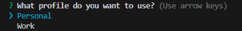

# Git Identity Manager

The **Git Identity Manager** simplifies managing multiple Git profiles for personal and work-related repositories. This tool enhances your workflow by enabling you to easily switch between different Git configurations, ensuring correct identity usage for each project.

## 🚀 Installation

To get started, install the Git Identity Manager globally using npm. This enables you to use it from any directory:

```shell
npm i -g git-identity-manager
```

## ⚙ Configuration

### **Step 1:** Generate SSH Keys

Create SSH keys for your personal and work accounts to maintain secure access:

```shell
ssh-keygen -t ed25519 -C "email@example.com" -f "~/.ssh/id_ed25519_personal"
ssh-keygen -t ed25519 -C "email@work.com" -f "~/.ssh/id_ed25519_work"
```

### **Step 2:** Add SSH Keys to the Agent

Add your SSH keys to the SSH agent to easily manage your identities:

```shell
eval "$(ssh-agent -s)"
ssh-add ~/.ssh/id_ed25519_personal
ssh-add ~/.ssh/id_ed25519_work
```

### **Step 3:** Link SSH Key to GitHub Account

Add your SSH keys to your GitHub account for secure access, following the [GitHub Documentation](https://docs.github.com/en/github/authenticating-to-github/adding-a-new-ssh-key-to-your-github-account).

### **Step 4:** Configure SSH Connection

Edit the `~/.ssh/config` file to differentiate your personal and work accounts:

```shell
# Personal account
Host github.com-personal
  HostName github.com
  User git
  IdentityFile ~/.ssh/id_ed25519_personal
  IdentitiesOnly yes

# Work account
Host github.com-work
  HostName github.com
  User git
  IdentityFile ~/.ssh/id_ed25519_work
  IdentitiesOnly yes
```

### **Step 5:** Create Configuration File

Define your Git identities in a `.git-identities.json` file in your home directory:

```json
{
  "personal": {
    "name": "John",
    "email": "johndoe@example.com",
    "customHostName": "github.com-personal"
  },
  "work": {
    "name": "John Doe",
    "email": "johndoework@example.com",
    "customHostName": "github.com-work"
  }
}
```

*Note: Add as many identities as needed. Ensure your GitHub profile matches the name, email, and customHostName.*

## 🌟 Usage

After installation and configuration, use the `git-clone` command to clone repositories seamlessly:

```shell
git-clone <git-repository-ssh-url>
```

Select an identity from your configuration to ensure correct profile usage for your projects.



> Important: Currently supported only SSH URL